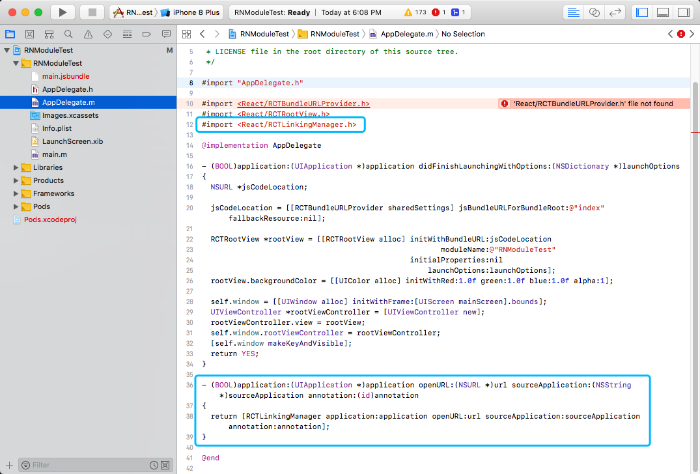
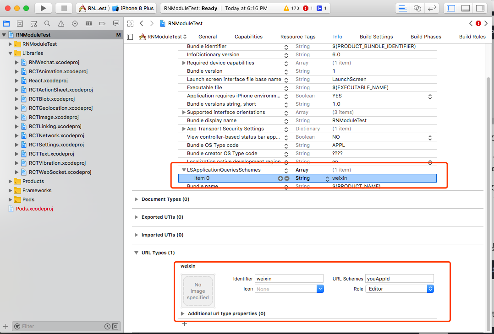
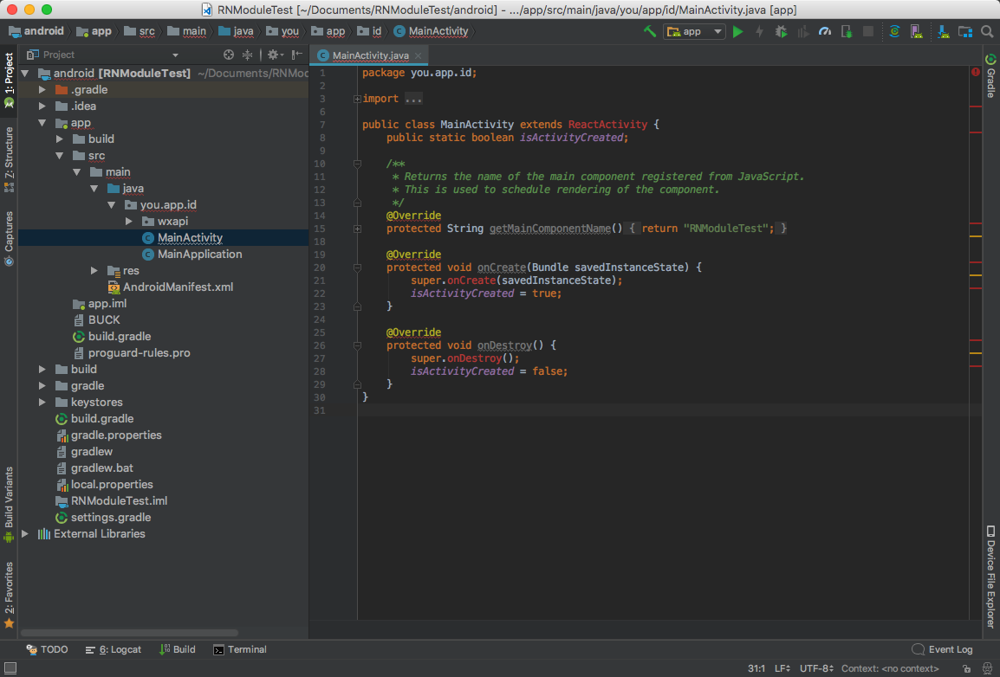
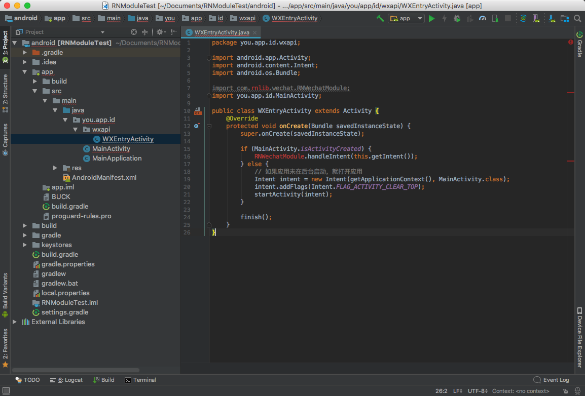
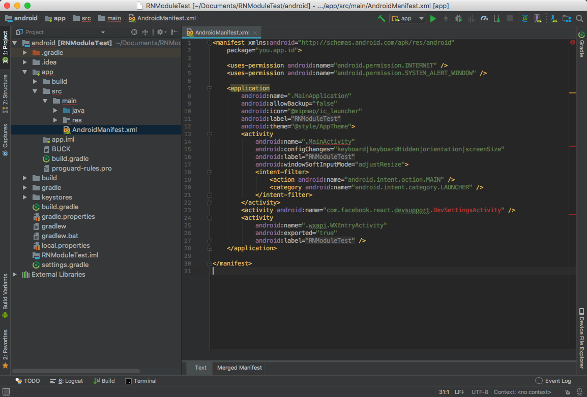
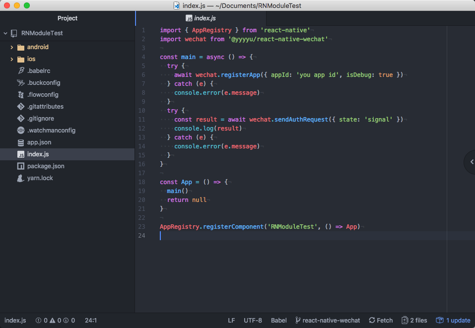

# react-native-wechat

## 安装

```bash
yarn add @yyyyu/react-native-wechat
```

or

```bash
npm install --save @yyyyu/react-native-wechat
```

## 配置

### ios

#### 1. 自动配置(推荐)

```bash
react-native link @yyyyu/react-native-wechat
```

如果项目**使用 Pods 管理依赖**需要在 Podfile 中添加

```ruby
pod 'React', :path => '../node_modules/react-native', :subspecs => ['Dependency']
```

#### 2. 手动配置

1. 使用 Xcode 打开项目，在项目依赖目录(Libraries)下添加 node_modules 中的 @yyyyu/react-native-wechat 项目
2. 在 Linked Frameworks and Libraries 添加 libRNWechat.a


#### 额外配置 [微信官方文档参考](https://open.weixin.qq.com/cgi-bin/showdocument?action=dir_list&id=1417694084&lang=zh_CN)

1. **手动配置和非 Pods 管理依赖情况**需要在 Linked Frameworks and Libraries 添加 libsqlite3.0 (方法同上)

2. 在 AppDelegate.m 文件中添加下列代码

    ```objective-c
    #import <React/RCTLinkingManager.h>

    - (BOOL)application:(UIApplication *)application openURL:(NSURL *)url sourceApplication:(NSString *)sourceApplication annotation:(id)annotation
    {
      return [RCTLinkingManager application:application openURL:url sourceApplication:sourceApplication annotation:annotation];
    }
    ```
    

3. 在 Info.plist 文件中添加 URL Schemes

   - identifier -> weixin
   - URL Schemes -> **你的 appId**

4. ​在 Info.plist 文件添加 LSApplicationQueriesSchemes 字段，值类型为 Array，添加字符串子元素 weixin 

### android

#### 1. 自动配置(如果 IOS 已经运行过，不需要重复运行)

```bash
react-native link @yyyyu/react-native-wechat
```

#### 2. 手动配置

1. 在 android/settings.gradle 文件中添加

    ```Groovy
    include ':react-native-wechat'
    project(':react-native-wechat').projectDir = new File(rootProject.projectDir, '../node_modules/@yyyyu/react-native-wechat/android')
    ```

2. 在 android/app/build.gradle 文件中依赖部分添加

    ```Groovy
    dependencies {
        // other dependencies
        compile project(':react-native-wechat')
    }
    ```

3. 在 MainApplication.java 文件中添加

    ```Java
    import com.rnlib.wechat.RNWechatPackage;

    @Override
    protected List<ReactPackage> getPackages() {
        return Arrays.<ReactPackage>asList(
            // other packages
            new RNWechatPackage()
        );
    }
    ```

#### 额外配置 [微信官方文档参考](https://open.weixin.qq.com/cgi-bin/showdocument?action=dir_list&id=1417751808&lang=zh_CN)

1. 在 MainActivity.java 文件中添加下列代码，标识出当前状态，在微信唤起应用时需要做不同处理

    ```java
    public class MainActivity extends ReactActivity {
        public static boolean isActivityCreated;

        @Override
        protected void onCreate(Bundle savedInstanceState) {
            super.onCreate(savedInstanceState);
            isActivityCreated = true;
        }

        @Override
        protected void onDestroy() {
            super.onDestroy();
            isActivityCreated = false;
        }
    }
    ```
    

2. 在应用包名下创建 wxapi 这个包，并新建 WXEntryActivity 类(这里要严格按照这种形式创建，否则无法接收到微信的应答)

    ```java
    package 包名.wxapi;

    import android.app.Activity;
    import android.content.Intent;
    import android.os.Bundle;

    import com.rnlib.wechat.RNWechatModule;

    import 包名.MainActivity;

    public class WXEntryActivity extends Activity {
        @Override
        protected void onCreate(Bundle savedInstanceState) {
            super.onCreate(savedInstanceState);

            if (MainActivity.isActivityCreated) {
                RNWechatModule.handleIntent(this.getIntent());
            } else {
              // 如果应用未在后台启动，就打开应用
                Intent intent = new Intent(getApplicationContext(), MainActivity.class);
                intent.addFlags(Intent.FLAG_ACTIVITY_CLEAR_TOP);
                startActivity(intent);
            }

            finish();
        }
    }
    ```
    

3. 如果需要使用微信支付功能，在 wxapi 这个包下新建 WXPayEntryActivity 类(注意此处类名和上面不同)

    ```java
    package 包名.wxapi;

    import android.app.Activity;
    import android.os.Bundle;

    import com.rnlib.wechat.RNWechatModule;

    public class WXPayEntryActivity extends Activity {
        @Override
        protected void onCreate(Bundle savedInstanceState) {
            super.onCreate(savedInstanceState);

            RNWechatModule.handleIntent(this.getIntent());

            finish();
        }
    }
    ```

4. 在 AndroidManifest.xml 中注册上述 activity

    ```xml
    <application>
      <activity
              android:name=".wxapi.WXEntryActivity"
              android:label="@string/app_name"
              android:exported="true" />
      <!-- 微信支付可选 -->
      <activity
              android:name=".wxapi.WXPayEntryActivity"
              android:label="@string/app_name"
              android:exported="true" />
    </application>
    ```
    

5. **应用一定要签名才能正常调用接口**，开发时也需要签名

    ```bash
    # 微信开放平台登记的就是 keystore 的签名，使用

    keytool -v -list -keystore 'you keystore' | grep MD5

    # 得到 XX:XX:XX:XX:XX:XX:XX:XX:XX:XX:XX:XX:XX:XX:XX:XX
    ```

    ```javascript
    在浏览器 console 格式化一下填到微信开放平台上

    'XX:XX:XX:XX:XX:XX:XX:XX:XX:XX:XX:XX:XX:XX:XX:XX'.replace(/:/g, '').toLowerCase()
    ```
    

## JS API

```javascript
import wechat from '@yyyyu/react-native-wechat'

wechat.registerApp({ appId: 'appId' })
  .then(res => { console.log(res) })
  .catch(err => { console.error(err) })
```


### 参数说明

1. 参数注释带有 optional 字样为可选参数，括号内为默认值，e.g. optional('default')
2. iosOnly androidOnly 表示只有在相应平台才会生效
3. 发送场景类型有 session (会话、聊天)  timeline (朋友圈)  favorite (收藏)，默认 session
4. 小程序类型有 test (测试版)  preview (体验版)  release (正式版)，默认 test
5. 图片、缩略图以下 4 种方式均可
    - local 资源 e.g. require('image.png')
    - base64 e.g. data:image/png;base64,...
    - 原生 path uri 路径字符串 (第三方库 [react-native-camera](https://github.com/react-native-community/react-native-camera)、[react-native-image-picker](https://github.com/react-community/react-native-image-picker) 等返回值)
    - 网络 uri e.g. https://reactjs.org/logo-og.png
6. 微信 SDK 限制: 标题文字大小不能超过 **512B**、描述文字大小不能超过 **1KB**、缩略图大小不能超过 **32KB**, 超过限制报错 **RequestFailed**

### 返回值说明

1. 错误代码

    ```javascript
    import { ErrCode } from '@yyyyu/react-native-wechat'

    console.log(ErrCode)

    {
      // 微信 sdk 返回错误类型
      Success: 0,        // 成功
      Common: -1,        // 普通错误
      UserCancel: -2,    // 点击取消返回
      SentFail: -3,      // 发送失败
      AuthDeny: -4,      // 授权失败
      Unsupport: -5,     // 不支持
      Ban: -6,           // 禁止(签名信息不正确时会出现这个错误) androidOnly
      // 自定义错误类型
      ActiveSuccess: 1,  // 发送请求后通过系统唤起(任务列表选择唤起)，无法判断成功失败
      RequestFailed: -7, // 请求失败
      UnRegisteApi: -8,  // 未注册接口
      UnInstall: -9,     // 未安装微信
      UnSupportApi: -10, // 不支持 Api
      Unknow: -99        // 未知错误
    }
    ```

2. 抛出错误处理方式

    ```javascript
    import { WechatError } from '@yyyyu/react-native-wechat'

    try {
      const res = await wechat.sendText({ text: 'example' })
      console.log(res)
    } catch (e) {
      if (e instanceof WechatError) {
          const { errCode, errMsg } = e
          console.error(errCode, errMsg)
      }
    }
    ```

#### registerApp 注册微信 api

```javascript
// @return Boolean
wechat.registerApp({
  appId: 'you app id', // 微信平台注册应用后得到的 appId
  isDebug: false,      // optional(false)
})
```

#### isWXAppInstalled 检测是否安装微信

```javascript
// @return Boolean
wechat.isWXAppInstalled()
```

#### isWXAppSupportApi 检测当前版本微信是否支持 Api

```javascript
// @return Boolean
wechat.isWXAppSupportApi()
```

#### getWXAppInstallUrl 获取微信 iTunes 的安装地址 iosOnly

```javascript
// @return String
wechat.getWXAppInstallUrl()
```

#### openWXApp 打开微信(需要先注册 api 才可以调用)

```javascript
wechat.openWXApp()
```

#### launchMiniProgram 打开小程序(安卓需要先注册 api 才可以调用)

```javascript
wechat.launchMiniProgram({
  username: 'you username', // 原始 id，微信开放平台注册小程序处获取
  path: '/path1/path2', // 小程序路由地址
  type: 'test' // 小程序类型 optional('release')
})
```

#### sendAuthRequest OAuth2 微信登录

```javascript
wechat.sendAuthRequest({
  state: 'state' // 返回值会包含相同的数据用于验证请求 optional('')
})
```

#### sendText 发送文字

```javascript
wechat.sendText({
  text: 'text', // 用于发送的文字
  scene: 'session' // 发送场景 optional('session')
})
```

#### sendImage 发送图片

```javascript
wechat.sendImage({
  image: require('path/image.png'), // 用于发送的图片
  scene: 'session' // 发送场景 optional('session')
})
```

#### sendMusic 发送音乐

```javascript
wechat.sendMusic({
  music: 'https://music.com/music.html', // 音乐地址
  data: 'https://music.com/data', // 音乐数据地址
  title: 'title', // 标题
  desc: 'description', // 描述
  thumb: require('path/thumb.png'), // 缩略图
  scene: 'session' // 发送场景 optional('session')
})
```

#### sendVideo 发送视频

```javascript
wechat.sendVideo({
  video: 'https://video.com/video', // 视频地址
  title: 'title', // 标题
  desc: 'description', // 描述
  thumb: require('path/thumb.png'), // 缩略图
  scene: 'session' // 发送场景 optional('session')
})
```

#### sendLink 发送链接

```javascript
wechat.sendLink({
  link: 'https://link.com/', // 链接地址
  title: 'title', // 标题
  desc: 'description', // 描述
  thumb: require('path/thumb.png'), // 缩略图
  scene: 'session' // 发送场景 optional('session')
})
```

#### sendMiniProgram 发送小程序

```javascript
wechat.sendMiniProgram({
  username: 'you username', // 原始 id，微信开放平台注册小程序处获取
  path: '/path1/path2', // 小程序路由地址
  title: 'title', // 标题
  desc: 'description', // 描述
  hdThumb: require('path/thumb.png'), // 缩略图
  link: 'https://www.link.com/', // 兼容旧版本链接，不支持小程序的微信版本会以此方式打开
  thumb: require('path/thumb.png'), // 兼容旧版本缩略图，不支持小程序的微信版本会看到此缩略图
  type: 'test' // 分享小程序类型 optional('release')
})
```

#### pay 支付(没有账号，未测试)

```javascript
wechat.pay({
  appId: 'you appId', // appId androidOnly 安卓 sdk 就是这样
  partnerId: 'you partnerId', // 商家 id
  prepayId: 'you prepayId', // 预支付订单 id
  nonceStr: 'nonceStr', // 随机串
  timestamp: 'timestamp', // 时间戳
  packageSign: 'you packageSign', // 财付通签名
  sign: 'you sign', // 微信开放平台签名
})
```
